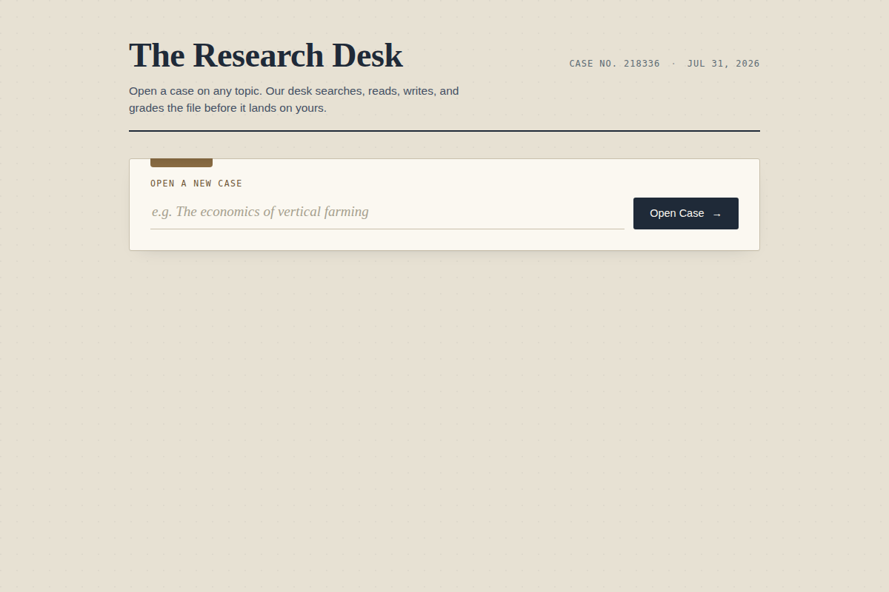
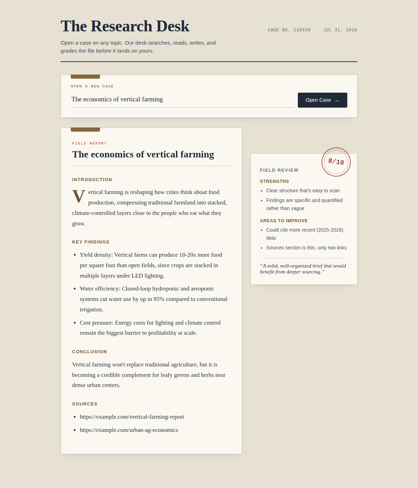
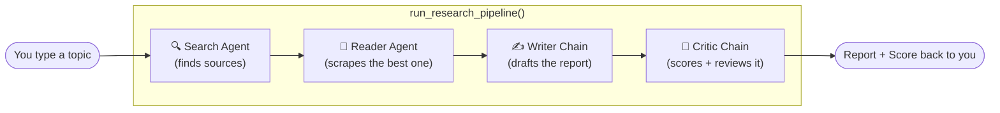
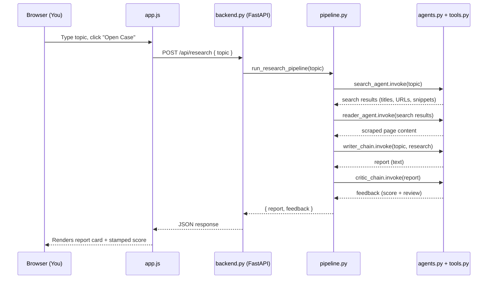

# The Research Desk

**An AI research pipeline — search → read → write → grade — behind a polished web UI.**

Give it a topic. It searches the web, reads the best source, writes a structured report, then critiques its own work and hands you a score.


<p align="center">
  <a href="#-run-it-locally-the-live-demo">
    
  </a>
  &nbsp;
  <a href="#-deploy-your-own">
    
  </a>
</p>

> **About the demo button:** this project isn't hosted anywhere public yet (it
> calls paid Mistral + Tavily APIs, so a public link would burn your API
> credits for strangers). The badge above jumps to the [local run
> instructions](#-run-it-locally-the-live-demo) — that's the real "demo" for
> a project like this. If you deploy it yourself (see [Deploy Your
> Own](#-deploy-your-own)), swap that badge's link for your live URL.

---

## What it looks like

**Empty state — opening a new case:**


**Filled state — report + graded critique:**


---

## What this project actually does

This is a small **multi-agent research assistant**. Instead of one AI model
doing everything in one shot, the work is split across four specialists that
each do one job well, in sequence:



| Step | Component | Job | Powered by |
|---|---|---|---|
| 1 | **Search Agent** | Finds recent, relevant sources for the topic | `web_search` tool (Tavily API) |
| 2 | **Reader Agent** | Picks the most relevant URL and scrapes its real content | `scrape_url` tool (`requests` + BeautifulSoup) |
| 3 | **Writer Chain** | Turns raw search results + scraped text into a structured report | Mistral LLM via a prompt template |
| 4 | **Critic Chain** | Grades the report out of 10 and lists strengths / gaps | Mistral LLM via a second prompt template |

The **web UI** just sits on top of this: it's a form that calls the pipeline
and displays the last two outputs (the report and the critique) in a
readable, dossier-style layout instead of a terminal wall of text.

---

## Project structure

```
research-desk/
├── tools.py             # The two tools agents can call: web_search, scrape_url
├── agents.py             # Builds the 4 pipeline components (2 agents + 2 LLM chains)
├── pipeline.py            # Wires the 4 components together into one function
├── backend.py             # NEW — FastAPI server: exposes the pipeline over HTTP, serves the UI
├── static/
│   ├── index.html          # NEW — page structure (form, report card, critique card)
│   ├── style.css           # NEW — the "field dossier" visual design
│   └── app.js               # NEW — talks to the backend, renders the JSON response
├── screenshots/            # NEW — images used in this README
├── requirements.txt         # NEW — exact dependencies to install
└── README.md                # NEW — this file
```

---

## How the pieces connect



---

## Setup

### 1. Get API keys
- **Mistral**: https://console.mistral.ai/ → API Keys
- **Tavily** (web search): https://tavily.com/ → API Keys

### 2. Create a `.env` file
In the project root, next to `backend.py`:
```env
MISTRAL_API_KEY=your_key_here
TAVILY_API_KEY=your_key_here
```

### 3. Install dependencies
```bash
pip install -r requirements.txt
```

## ▶ Run it locally (the "live demo")

```bash
uvicorn backend:app --reload
```
Then open **http://127.0.0.1:8000** in your browser, type a topic, and click
**Open Case**. First run takes ~10–30 seconds (two web calls + two LLM calls).

## ☁ Deploy your own

Since it's just a FastAPI app, it deploys anywhere Python apps run:

| Platform | Notes |
|---|---|
| [Render](https://render.com) | Free tier works; set start command to `uvicorn backend:app --host 0.0.0.0 --port $PORT` |
| [Railway](https://railway.app) | Same start command; add `MISTRAL_API_KEY` / `TAVILY_API_KEY` as environment variables |
| Any VPS | Run behind nginx with `uvicorn backend:app --host 0.0.0.0 --port 8000` |

Once deployed, replace the "Deploy" badge link at the top of this README with
your live URL so visitors can click straight through.

---

## Bugs fixed while building this

Two issues in the original files would have crashed the app before it ever
ran:

1. **`agents.py`** — `writer_prompt`'s message list was missing a comma
   between the `("system", ...)` and `("human", ...)` tuples. Python read
   this as "call the first tuple like a function," which raised
   `TypeError: 'tuple' object is not callable` the instant the module loaded.
2. **`tools.py`** — had `topic = input("You: ")` and `print(...)` running at
   the top level of the file. Since `agents.py` does
   `from tools import web_search, scrape_url`, importing it would trigger
   that `input()` immediately and freeze anything that imported it (like a
   web server) waiting for terminal input that would never come. Moved under
   `if __name__ == "__main__":` so it only runs when you execute
   `tools.py` directly.

`pipeline.py` was not changed.

---

## License

MIT — use it, fork it, learn from it.
